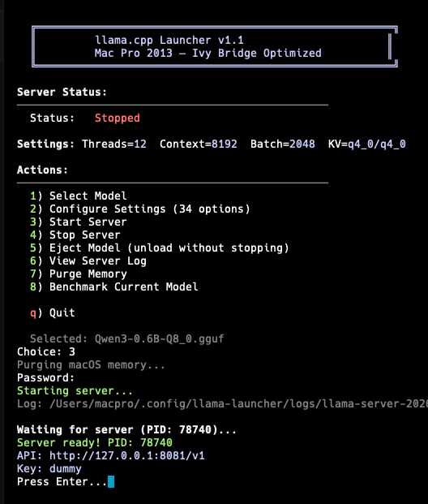

# intellama

Optimized terminal launcher for local GGUF models on Intel x64 Macs, built around a pinned `llama.cpp` binary package and an interactive `intellama` menu (formerly `llama-cli`).



## What This Is

`llama-cli` packages an optimized `llama.cpp` build and a zsh terminal launcher for Intel Macs. The default profile is tuned for the 12-core Mac Pro 2013 / Xeon E5 Ivy Bridge class of machines running modern macOS through OCLP.

The launcher scans `~/models` for `.gguf` files, lets you choose a model by number, configures server/runtime settings, starts an OpenAI-compatible local API server, tracks only the server it started, and writes logs under `~/.config/llama-launcher/logs`.

## Install With npm

```bash
npm install -g intellama
intellama
```

> Back-compat: the `llama-cli` command is still installed as an alias to `intellama` for this release.

Put models anywhere under:

```bash
~/models
```

You can override paths:

```bash
MODELS_DIR=/Volumes/Models intellama
LLAMA_DIR=/usr/local/llama-cpp intellama
```

## Standalone Archive Install

Download or copy one of the release archives from `releases/`.

```bash
tar xzf releases/llama-cpp-macpro-optimized.tar.gz
cd llama-cpp-macpro
./install.sh
/usr/local/llama-cpp/bin/llama-launcher.sh
```

ZIP is also available:

```bash
unzip releases/llama-cpp-macpro-optimized.zip
cd llama-cpp-macpro
./install.sh
```

## Included Tools

| Tool | Purpose |
|---|---|
| `intellama` | NPM command that launches the terminal app |
| `llama-cli` | Back-compat alias to `intellama` |
| `llama-launcher.sh` | Interactive zsh launcher |
| `llama-server` | OpenAI-compatible API server |
| `llama-bench` | Local benchmark runner |
| `llama-quantize` | Quantization utility |
| `llama-perplexity` | Perplexity testing utility |

## Build Profile

The bundled `llama.cpp` build is CPU-first and tuned for Ivy Bridge:

```text
GGML_AVX=ON
GGML_AVX2=OFF
GGML_FMA=OFF
GGML_F16C=ON
GGML_METAL=OFF
GGML_BLAS=ON
GGML_BLAS_VENDOR=Apple
CFLAGS=-march=ivybridge -mtune=ivybridge
CXXFLAGS=-march=ivybridge -mtune=ivybridge
```

Why CPU-first: on this Mac Pro/OCLP setup, `llama-server` reports no usable GPU for this build, and the tested stable path is Apple Accelerate BLAS on CPU with AVX/F16C and no AVX2/FMA.

## Default Runtime Profile

The launcher defaults are conservative for a 12-core / 64 GB RAM Intel Mac Pro:

| Setting | Default |
|---|---|
| Threads | `12` |
| Context | `8192` |
| Batch | `2048` |
| uBatch | `512` |
| GPU layers | `0` |
| KV cache | `q4_0/q4_0` |
| mmap | disabled |
| mlock | enabled |
| Fit | `on` |
| Server | `127.0.0.1:8081` |

Direct server example:

```bash
llama-server \
  -m ~/models/model-folder/model.gguf \
  -ngl 0 -t 12 -tb 12 \
  --mlock --no-mmap \
  -c 8192 -b 2048 -ub 512 \
  --cache-type-k q4_0 --cache-type-v q4_0 \
  --fit on \
  --port 8081 --host 127.0.0.1
```

OpenAI-compatible endpoint:

```text
http://127.0.0.1:8081/v1
```

API key can be any placeholder value, for example `dummy`.

## Launcher Features

- Lists every `.gguf` model under `~/models`, including models in separate folders.
- Saves settings in `~/.config/llama-launcher/settings.conf`.
- Starts `llama-server` in the background and records its PID.
- Avoids killing unrelated `llama-server` processes from other apps.
- Shows health, memory, uptime, and loaded model when available.
- Offers model eject through the server unload endpoint, with stop fallback.
- Supports advanced flags including context, batch, threads, KV cache type, RoPE settings, MoE CPU options, prompt cache RAM, cache reuse, custom Jinja chat template, and fit target.

## Performance Notes

Measured on the target Mac Pro profile:

| Model | Generation | Prompt | Output |
|---|---:|---:|---|
| Dense 27B Q6_K | about 1.9 tok/s | about 3.2 tok/s | clean |
| Qwopus3.6 35B A3B Q8_0 | about 8.6 tok/s | about 20.8 tok/s | bad conversion output in testing |

Model quality and GGUF conversion correctness matter. Runtime flags cannot fix corrupted or badly converted weights.

## GPU / Experimental Backends

This package intentionally ships the stable CPU/Accelerate build. Current practical notes:

- `vLLM` is strongest on Linux GPU servers. Its macOS GPU path is aimed at Apple Silicon through vLLM-Metal/MLX, not Intel Mac Pro FirePro GPUs.
- `llama.cpp` Metal can work on some Intel Mac AMD systems, but this target build and OCLP setup reported no usable GPU during testing.
- Vulkan/ROCm paths are worth testing on Linux or newer AMD hardware. They are not the default here because the goal is a portable package that works on the matching Intel Mac without extra driver work.

If you want to experiment, keep this CPU build as the stable baseline and create a separate `LLAMA_DIR` build with Metal or Vulkan so the launcher can switch via:

```bash
LLAMA_DIR=/path/to/experimental/llama.cpp/build intellama
```

## Rebuild Release Archives

From this repo on the optimized Mac:

```bash
npm run pack:release
```

This rebuilds:

```text
vendor/llama-cpp-macpro.tar.gz
releases/llama-cpp-macpro-optimized.tar.gz
releases/llama-cpp-macpro-optimized.zip
```

## Development

```bash
npm test
npm pack
```

Local run without global install:

```bash
node bin/intellama.js
```

## Renamed from `llama-cli`

This project was previously published as `llama-cli`. The `llama-cli` npm
command still works as an alias to `intellama` for backwards compatibility.
The on-disk launcher (`llama-launcher.sh`) and config dir
(`~/.config/llama-launcher/`) keep their original names.

## License

MIT. The bundled `llama.cpp` binaries are built from `llama.cpp`; see the upstream project license for its components.
